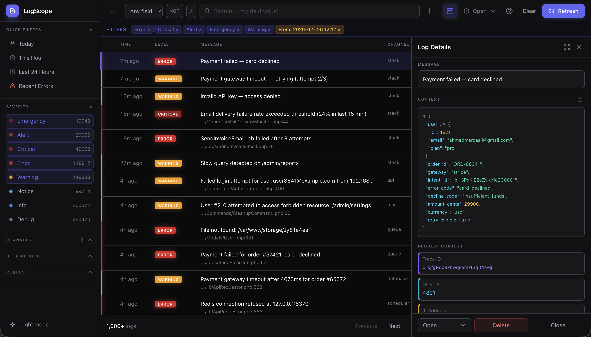

# LogScope

[](https://packagist.org/packages/ahmedmerza/logscope)
[](https://packagist.org/packages/ahmedmerza/logscope)
[](https://packagist.org/packages/ahmedmerza/logscope)

A beautiful, database-backed log viewer for Laravel applications. Production-ready.

<!-- TODO: Add screenshot here -->


## Quick Start

```bash
composer require ahmedmerza/logscope
php artisan logscope:install
php artisan migrate
```

Visit `/logscope` in your browser. That's it!

---

## What's New

**Latest: [v1.5.6](https://github.com/AhmedMerza/laravel-logscope/releases/tag/v1.5.6)** — In-UI failure banner + Octane terminate-chain hardening + quick-filter timezone fix.

See [CHANGELOG.md](CHANGELOG.md) for full release history and behavior-change notes.

---

## Table of Contents

- [Features](#-features)
- [Requirements](#-requirements)
- [When to Use LogScope](#-when-to-use-logscope)
- [Installation](#-installation)
- [Configuration](#%EF%B8%8F-configuration)
- [Usage](#-usage)
- [Production Deployment](#-production-deployment)
- [Customization](#-customization)
- [Contributing](#-contributing)
- [License](#-license)

---

## ✨ Features

| Feature | Description |
|---------|-------------|
| **Zero-Config Capture** | Automatically captures ALL logs from ALL channels |
| **Request Context** | Trace ID, user ID, IP, URL, and user agent for every log |
| **Advanced Search** | Search syntax (`field:value`), regex support, NOT toggle |
| **Smart Filters** | Include/exclude by level, channel, HTTP method, date range |
| **Active Filters Bar** | See all active filters at a glance, clear individually |
| **Channel Search** | Search and filter channels when you have many |
| **JSON Viewer** | Syntax-highlighted, collapsible JSON with copy support |
| **Smart Context** | Auto-expand Request/Model objects, redact sensitive data |
| **Status Workflow** | Track logs as open, investigating, resolved, or ignored |
| **Log Notes** | Add investigation notes to any log entry |
| **Quick Filters** | One-click filters for common queries |
| **Keyboard Shortcuts** | 14 shortcuts for navigation, status changes, and actions |
| **Dark Mode** | Full dark mode support with persistence |
| **Shareable URLs** | Current filters reflected in URL for sharing |
| **Deep Linking** | Link directly to specific log entries |
| **Performance** | Keyset pagination, batch writes, query optimization, proper indexing |

---

## 📋 Requirements

- PHP 8.2+
- Laravel 10+
- SQLite, MySQL, or PostgreSQL

---

## 🤔 When to Use LogScope

LogScope stores logs in your database - a deliberate choice that works great for most Laravel apps.

**Great fit if you:**
- Want log visibility without external services
- Have a typical Laravel app (up to ~100K requests/day)
- Need rich search and filtering
- Prefer simplicity over infrastructure complexity

**Consider alternatives if you:**
- Process millions of requests daily
- Need months/years of log retention
- Already use centralized logging (Datadog, CloudWatch, ELK)

**How LogScope handles common concerns:**

| Concern | Solution |
|---------|----------|
| Database bloat | Retention policies with scheduled pruning (default: 30 days) |
| Performance | Batch mode writes logs *after* response is sent |
| Query speed | Proper indexes on common filter combinations |

---

## ⚠️ Known Limitations

LogScope captures everything that flows through Laravel's logger (`Illuminate\Log\Logger`). A few categories of logs structurally bypass that path and **cannot be auto-captured**. These are PHP / framework limitations, not bugs we can fix from a Composer package.

### 1. PHP's native `error_log()` is not interceptable

`error_log("...")` is a built-in PHP function that writes directly to the destination configured in `php.ini`'s `error_log` directive (file, syslog, or stderr). It calls into PHP's C-level logging, never invokes `set_error_handler`, and there's no userland API to redirect it. Workarounds (the [`uopz`](https://www.php.net/manual/en/book.uopz.php) extension, php.ini overrides, stderr capture) all live outside the PHP application — out of scope for a package.

If your app or a dependency calls `error_log()`, those messages land in your php-fpm/server log, **not** in LogScope. Search both places when investigating.

### 2. `trigger_error(E_USER_*)` *should* work, but depends on Laravel's exception handler

PHP routes `trigger_error()` through the registered `set_error_handler`, and Laravel's `HandleExceptions` bootstrapper installs one that converts these to `ErrorException` and reports them — which then fires `MessageLogged` and reaches LogScope. So in normal HTTP/CLI flow this works.

**It can break in specific contexts** where Laravel's exception handler is bypassed:
- `php artisan tinker` (skips reporting via `runningUnitTests()`-style guards in some versions)
- Custom `set_error_handler` calls in user code that don't chain to the previous handler
- `error_reporting` being lowered to exclude `E_USER_*` levels

If something seems missing here, check `error_reporting()` and that `\Illuminate\Foundation\Bootstrap\HandleExceptions::class` is in your bootstrap chain (it is by default in Laravel 10/11/12).

### 3. Direct Monolog instances bypass capture

If a dependency (or your own code) does:

```php
$logger = new \Monolog\Logger('foo');
$logger->error('something');
```

…that's a raw Monolog logger, not Laravel's `Illuminate\Log\Logger`. Only Laravel's logger fires `MessageLogged`. The Monolog instance has no way to know LogScope exists.

**Opt-in workaround:** push our handler onto the Monolog instance:

```php
use LogScope\Logging\LogScopeHandler;

$logger = new \Monolog\Logger('foo');
$logger->pushHandler(new LogScopeHandler('foo'));  // 'foo' = the channel name to record
$logger->error('captured by LogScope now');
```

Auto-instrumentation isn't possible — we'd have to patch the `Monolog\Logger` class itself.

### 4. SIGKILL / segfault / E_PARSE in batch write mode loses the buffered batch

Batch mode (`LOGSCOPE_WRITE_MODE=batch`, default) accumulates logs during the request and flushes them on `app->terminating()` or PHP shutdown. Both safety nets require a graceful shutdown:

- `kill -9` (SIGKILL): cannot be caught by PHP — buffer is gone
- OOM kill: same
- `E_PARSE` / `E_COMPILE_ERROR`: PHP can't run user code at shutdown for these

**If low-loss is critical**, set `LOGSCOPE_WRITE_MODE=sync` to write every log immediately. Cost: each `Log::*()` call adds a synchronous DB round-trip.

### 5. `null_channel` filter — read before enabling

`LOGSCOPE_IGNORE_NULL_CHANNEL=true` drops logs that LogScope can't attribute to a named channel. **This includes Laravel's own framework-level error reporter in some configurations**, which means enabling this flag may silently drop unhandled exceptions. Only enable if you know exactly which no-channel logs flow through your app.

---

## 📦 Installation

```bash
composer require ahmedmerza/logscope
```

Run the install command:

```bash
php artisan logscope:install
php artisan migrate
```

Access the dashboard at `/logscope`.

---

## ⚙️ Configuration

After installation, configure LogScope in `config/logscope.php` or via environment variables.

### Capture Mode

```env
# 'all' (default) - Capture all logs automatically
# 'channel' - Only capture logs sent to the logscope channel
LOGSCOPE_CAPTURE=all
```

### Write Mode (Performance)

```env
# 'batch' (default) - Buffer logs, write after response
# 'sync' - Write immediately (simple, but slower)
# 'queue' - Queue each log entry (best for high-traffic)
LOGSCOPE_WRITE_MODE=batch

# Queue settings (when using 'queue' mode)
LOGSCOPE_QUEUE=default
LOGSCOPE_QUEUE_CONNECTION=
```

### Retention

```env
LOGSCOPE_RETENTION_ENABLED=true
LOGSCOPE_RETENTION_DAYS=30
```

> **Note:** Retention requires scheduling `logscope:prune` - see [Schedule Pruning](#schedule-pruning).

### Features

```env
LOGSCOPE_FEATURE_STATUS=true       # Enable status workflow
LOGSCOPE_FEATURE_NOTES=true        # Add notes to logs
```

### Noise Reduction

```env
# Filter out noisy logs
LOGSCOPE_IGNORE_DEPRECATIONS=true  # Skip "is deprecated" messages (default: true)
LOGSCOPE_IGNORE_NULL_CHANNEL=false # Skip logs without a channel (default: false)
```

> **Note:** `null_channel` defaults to `false` because `Log::build()` (dynamic loggers) produce logs without a channel. Setting this to `true` would filter out those logs.

### Cache TTL

```env
# How long (in seconds) to cache stats and filter options (levels, channels, etc.)
# Set to 0 to disable caching
LOGSCOPE_CACHE_TTL=60
```

### JSON Viewer

Configure collapsible JSON behavior in `config/logscope.php`:

```php
'json_viewer' => [
    'collapse_threshold' => 5,  // Auto-collapse arrays/objects larger than this
    'auto_collapse_keys' => ['trace', 'stack_trace', 'stacktrace', 'backtrace'],
],
```

### Routes

```env
LOGSCOPE_ROUTES_ENABLED=true
LOGSCOPE_ROUTE_PREFIX=logscope
LOGSCOPE_DOMAIN=
LOGSCOPE_FORBIDDEN_REDIRECT=/
LOGSCOPE_UNAUTHENTICATED_REDIRECT=/login
```

Add middleware and configure error redirects:

```php
'routes' => [
    'middleware' => ['web', 'auth'],
    'forbidden_redirect' => '/',           // Where to redirect on 403 (access denied)
    'unauthenticated_redirect' => '/login', // Where to redirect on 401/419 (session expired)
],
```

### Error Handling

LogScope handles errors gracefully with toast notifications:

| Error | Behavior |
|-------|----------|
| 401/419 (Session expired) | Toast + redirect to `unauthenticated_redirect` |
| 403 (Access denied) | Toast + redirect to `forbidden_redirect` |
| 429 (Rate limited) | Toast only (retry later) |
| 500+ (Server error) | Toast only (temporary issue) |
| Network error | Toast only (check connection) |

> **Note:** Redirect URLs can be relative paths (`/login`) or absolute URLs (`https://auth.example.com/login`).

---

## 🚀 Usage

### Automatic Capture

All logs are captured automatically - no code changes needed:

```php
Log::info('User logged in', ['user_id' => 1]);
Log::channel('slack')->error('Payment failed');
Log::stack(['daily', 'slack'])->warning('Low inventory');
```

### Keyboard Shortcuts

| Key | Action |
|-----|--------|
| `j` / `k` | Navigate down / up |
| `h` / `l` | Previous / next page |
| `r` | Refresh data |
| `Enter` | Open detail panel |
| `Esc` | Close panel |
| `/` | Focus search |
| `y` | Copy context (yank) |
| `n` | Focus note field |
| `c` | Clear all filters |
| `d` | Toggle dark mode |
| `?` | Show keyboard help |

**Status shortcuts** (require Shift, filter by status):
| `O` | Open | `I` | Investigating | `R` | Resolved | `X` | Ignored |

Action shortcuts (`r`, `h`, `l`) and status shortcuts are configurable — see [Keyboard Shortcuts](#keyboard-shortcuts).

### Search Syntax

Type directly in the search box using `field:value` syntax:

| Syntax | Example | Description |
|--------|---------|-------------|
| `field:value` | `message:error` | Search in specific field |
| `-field:value` | `-level:debug` | Exclude matches |
| `field:"value"` | `message:"user login"` | Quoted values with spaces |
| `text` | `error` | Search in all fields |
| `-text` | `-deprecated` | Exclude from all fields |

**Searchable fields:** `message`, `source`, `context`, `level`, `channel`, `user_id`, `ip_address`, `url`, `trace_id`, `http_method`

> **Tip:** Request context filters (trace ID, user ID, IP, URL) support partial matching. Type `192.168` to find all IPs starting with that prefix, or `42` to find user IDs containing "42".

> **Tip:** Click on trace ID, user ID, or IP address in the detail panel to pivot your investigation — severity, channel, status, and search filters are cleared so nothing is hidden. Your date range is preserved.

**Examples:**

```bash
# Find errors in the API channel
channel:api level:error

# Find payment logs excluding debug
channel:payment -level:debug

# Find logs mentioning a specific user ID
user_id:123

# Find logs containing "timeout" anywhere
timeout

# Find logs with "connection failed" in message
message:"connection failed"

# Find context containing a job ID
context:abc123

# Exclude deprecated warnings
-message:deprecated

# Combine multiple conditions
level:error channel:database message:timeout

# Find all POST requests
http_method:POST

# Find logs from specific URL path
url:/api/payments

# Exclude health check endpoints
-url:/health -url:/ping

# Find logs from specific IP range
ip_address:192.168

# Track a specific request by trace ID
trace_id:abc-123-def
```

**Regex mode:** Click the `.*` button to enable regex patterns:

```bash
# Match error OR warning levels
level:error|warning

# Match any payment-related message
message:payment.*failed

# Match IP addresses starting with 192.168
ip_address:192\.168\.\d+\.\d+
```

Both search syntax and regex can be disabled in config if not needed.

### Status Workflow

Logs have a status workflow: **Open** → **Investigating** → **Resolved** or **Ignored**.

Customize who changed the status:

```php
// In AppServiceProvider::boot()
use LogScope\LogScope;

LogScope::statusChangedBy(function ($request) {
    return $request->user()?->name;
});
```

#### Customize Statuses

Override built-in statuses or add new ones in `config/logscope.php`:

```php
'statuses' => [
    // Override built-in status
    'investigating' => [
        'label' => 'In Progress',
        'color' => 'blue',
    ],
    // Add custom statuses
    'waiting' => [
        'label' => 'Waiting for Customer',
        'color' => 'orange',
        'closed' => false,  // Shows in "Needs Attention"
    ],
    'duplicate' => [
        'label' => 'Duplicate',
        'color' => 'purple',
        'closed' => true,   // Hidden from "Needs Attention"
    ],
],
```

Available colors: `gray`, `yellow`, `green`, `slate`, `blue`, `red`, `orange`, `purple`

### Quick Filters

Configure one-click filters in `config/logscope.php`:

```php
'quick_filters' => [
    ['label' => 'Today', 'icon' => 'calendar', 'from' => 'today'],
    ['label' => 'Recent Errors', 'icon' => 'alert', 'levels' => ['error', 'critical'], 'from' => '-24 hours'],
    ['label' => 'Needs Attention', 'icon' => 'filter', 'statuses' => ['open', 'investigating']],
    ['label' => 'Resolved Today', 'icon' => 'filter', 'statuses' => ['resolved'], 'from' => 'today'],
],
```

Available options: `label`, `icon` (calendar/clock/alert/filter), `levels`, `statuses`, `from`, `to`

### Status Shortcuts

Each status has a default keyboard shortcut (uppercase, requires Shift). Customize in `config/logscope.php`:

```php
'statuses' => [
    // Disable a shortcut
    'ignored' => ['shortcut' => null],
    // Custom status with shortcut
    'waiting' => ['label' => 'Waiting', 'color' => 'orange', 'shortcut' => 'w'],
],
```

### Keyboard Shortcuts

Action shortcuts (refresh, pagination) are configurable or can be disabled:

```php
'keyboard_shortcuts' => [
    'refresh'   => 'r',  // Refresh logs and stats
    'prev_page' => 'h',  // Previous page
    'next_page' => 'l',  // Next page
],
```

Set any shortcut to `null` to disable it:

```php
'keyboard_shortcuts' => [
    'prev_page' => null,  // Disable previous page shortcut
    'next_page' => null,
],
```

### Authorization

LogScope uses a flexible auth system (checked in order):

**1. Custom Callback:**
```php
LogScope::auth(fn ($request) => $request->user()?->isAdmin());
```

**2. Gate:**
```php
Gate::define('viewLogScope', fn ($user) => $user->hasRole('admin'));
```

**3. Default:** Only accessible in `local` environment.

### Custom Context

Add custom data to every log entry (e.g., API token ID, tenant ID):

```php
// In AppServiceProvider::boot()
use LogScope\LogScope;

LogScope::captureContext(function ($request) {
    return [
        'token_id' => $request->user()?->currentAccessToken()?->id,
        'tenant_id' => $request->user()?->tenant_id,
    ];
});
```

This data is merged into the log's `context` field and appears in the JSON viewer.

### Artisan Commands

```bash
# Import existing log files (one-time migration)
php artisan logscope:import
php artisan logscope:import storage/logs/laravel.log --days=7

# Prune old logs
php artisan logscope:prune
php artisan logscope:prune --dry-run
php artisan logscope:prune --days=14
```

> **Note:** The import command is a one-time migration for existing log files. After setup, new logs are captured automatically.

---

## 🏭 Production Deployment

### Recommended Settings

```env
LOGSCOPE_WRITE_MODE=batch
LOGSCOPE_RETENTION_DAYS=14
LOG_LEVEL=info
```

### Schedule Pruning

```php
// Laravel 11+ (routes/console.php)
Schedule::command('logscope:prune')->daily();

// Laravel 10 (app/Console/Kernel.php)
$schedule->command('logscope:prune')->daily();
```

### High-Traffic Apps

For thousands of requests/day:

1. Use queue mode with a dedicated queue:
   ```env
   LOGSCOPE_WRITE_MODE=queue
   LOGSCOPE_QUEUE=logs
   ```

2. Run a separate queue worker:
   ```bash
   php artisan queue:work --queue=logs
   ```

3. Consider shorter retention (7 days).

---

## 🎨 Customization

### Theme

Customize the appearance in `config/logscope.php`:

```php
'theme' => [
    // Primary accent color (buttons, links, selections)
    'primary' => '#10b981',

    // Default to dark mode for new users (users can toggle and preference is saved)
    'dark_mode_default' => true,

    // Google Fonts (set to false to use system fonts)
    'fonts' => [
        'sans' => 'Outfit',         // UI text
        'mono' => 'JetBrains Mono', // Code/logs
    ],

    // Log level badge colors
    'levels' => [
        'error' => ['bg' => '#dc2626', 'text' => '#ffffff'],
        'warning' => ['bg' => '#f59e0b', 'text' => '#1f2937'],
        // ... other levels
    ],
],
```

**Disable external fonts** (use system fonts instead):

```php
'fonts' => [
    'sans' => false,
    'mono' => false,
],
```

### Context Sanitization

LogScope automatically expands objects in your log context for better debugging:

```php
// Request objects show useful data
Log::info('API request', ['request' => $request]);
// Context: { "request": { "_type": "request", "method": "POST", "url": "...", "input": {...} } }

// Models and Arrayable objects are converted
Log::info('User action', ['user' => $user]);
// Context: { "user": { "name": "John", "email": "..." } }
```

**Sensitive data is automatically redacted** (password, token, api_key, credit_card, etc.):

```php
Log::info('Login', ['request' => $request]);
// Input: { "email": "john@example.com", "password": "[REDACTED]" }
```

Configure in `config/logscope.php`:

```php
'context' => [
    'expand_objects' => true,      // Set false to show [Object: ClassName]
    'redact_sensitive' => true,    // Set false to disable redaction (not recommended)
    'sensitive_keys' => [],        // Empty = use defaults, or provide your own list
    'sensitive_headers' => [],     // Empty = use defaults, or provide your own list
],
```

### Publishing Assets

```bash
php artisan vendor:publish --tag=logscope-config
php artisan vendor:publish --tag=logscope-migrations
php artisan vendor:publish --tag=logscope-views
```

### All Environment Variables

```env
# Capture & Performance
LOGSCOPE_CAPTURE=all
LOGSCOPE_WRITE_MODE=batch
LOGSCOPE_QUEUE=default
LOGSCOPE_QUEUE_CONNECTION=

# Features
LOGSCOPE_FEATURE_STATUS=true
LOGSCOPE_FEATURE_NOTES=true
LOGSCOPE_FEATURE_SEARCH_SYNTAX=true
LOGSCOPE_FEATURE_REGEX=true
LOGSCOPE_IGNORE_DEPRECATIONS=true
LOGSCOPE_IGNORE_NULL_CHANNEL=false

# Database & Retention
LOGSCOPE_TABLE=log_entries
LOGSCOPE_RETENTION_ENABLED=true
LOGSCOPE_RETENTION_DAYS=30
LOGSCOPE_MIGRATIONS_ENABLED=true

# Routes
LOGSCOPE_ROUTES_ENABLED=true
LOGSCOPE_ROUTE_PREFIX=logscope
LOGSCOPE_DOMAIN=
LOGSCOPE_MIDDLEWARE_ENABLED=true
LOGSCOPE_FORBIDDEN_REDIRECT=/
LOGSCOPE_UNAUTHENTICATED_REDIRECT=/login

# Search
LOGSCOPE_SEARCH_DRIVER=database

# Cache
LOGSCOPE_CACHE_TTL=60

# Context Sanitization
LOGSCOPE_EXPAND_OBJECTS=true
LOGSCOPE_REDACT_SENSITIVE=true
```

---

## 🛡️ Extensions

### LogScope Guard

Block malicious IPs directly from the LogScope UI and sync the blacklist across all your environments automatically.

```bash
composer require ahmedmerza/logscope-guard
php artisan guard:install
```

[View LogScope Guard →](https://github.com/AhmedMerza/laravel-logscope-guard)

---

## 🤝 Contributing

Contributions are welcome! Please open an issue or submit a pull request.

---

## 📄 License

MIT License. See [LICENSE](LICENSE) for details.
